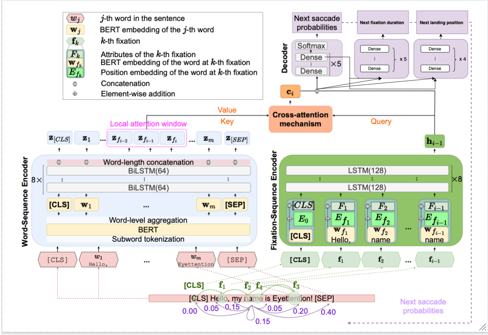

# Enhancing Human Scanpath Prediction using an Attention-based Dual-Sequence Model

Master Thesis by Iuliia Mozhina, University of Potsdam, Institute of Computer Science (2024)

This work is based on the original Eyettention model introduced by Deng, et al (2023): https://arxiv.org/abs/2304.10784. 
**Eyettention 2.0** is the first attention-based dual-sequence model capable of simultaneously predicting fixation locations, durations, and within-word landing positions. 



## Datasets 
1. Beijing Sentence Corpus (BSC)
The BSC dataset can be found in the /Data/beijing-sentence-corpus directory of this repository.

2. CELER
Instructions on how to download the CELER dataset can be found in the official repo of the dataset: https://github.com/berzak/celer .

3. Zurich Cognitive Language Processing Corpus (ZuCo)
The pre-processed ZuCo files can be found in the /Data/zuco directory of this repository. The original dataset can be found under https://osf.io/uxamg/ .

4. Zurich Cognitive Language Processing Corpus 2.0 (ZuCo 2.0)
The pre-processed ZuCo 2.0 files can be found in the /Data/zuco2 directory of this repository. The original dataset can be found under https://osf.io/2urht/ .

## How to reproduce the experiments 

### Clone the repository
```
git clone git@github.com:iuliia-mozhina/eyettention-v2.0.git
```

### Install the requirements 
```
pip install -r requirements.txt
```


### Run experiments for Chinese (BSC)
1. New Sentence split & New Reader split
```
Eyettention_BSC.ipynb
```

2. New Sentence / New Reader split

```
Eyettention_BSC_NRS.ipynb
```

3. Eyettention Reader 2.0
```
Eyettention_Reader_BSC.ipynb
```

### Run experiments for English (CELER)
1. New Sentence split & New Reader split
```
Eyettention_CELER.ipynb
```
2. New Sentence / New Reader split

```
Eyettention_CELER_NRS.ipynb
```
3. Eyettention Reader 2.0
```
Eyettention_Reader_CELER.ipynb
```

### Run cross-dataset evaluation
1. Train & test on Zuco

```
Eyettention_Zuco_training.ipynb
```

2. Pre-train on CELER, fine-tune on Zuco
```
Eyettention_Zuco_finetuning.ipynb
```


